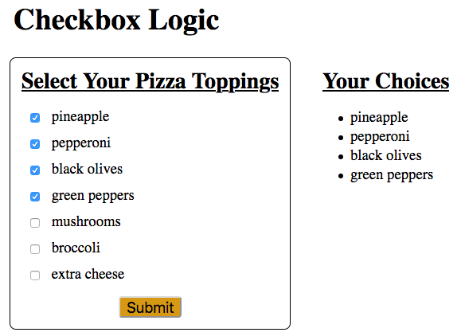

Conditionals in Templates
=========================

In addition to loops, we can also include conditionals inside our Jinja3
templates. These evaluate :ref:`boolean expressions <boolean-expression>` and
then add or remove HTML elements to the webpage.

Conditionals come in handy when we need to choose whether or not to display
specific content.

``if/elif/else`` Syntax
-----------------------

The general syntax for a Jinja3 conditional is:

.. sourcecode:: HTML
   :linenos:

   
      <!-- HTML code block -->
   

Just like in Python, ``condition`` is a boolean expression that evaluates to
``True`` or ``False``. If ``True``, then the code block is added to the
webpage. If ``False``, the HTML is NOT generated, and the content stays off the
page.

We can include ``elif`` and ``else`` clauses to provide more flexibility for our
page design.

.. sourcecode:: HTML
   :linenos:

   
      <!-- HTML code block -->
   
      <!-- Different HTML code block -->
   
      <!-- Third HTML code block -->
   

Depending on the results of ``condition_1`` and ``condition_2``, one of the
three code blocks will appear on the page. The HTML in each part can be any
length and include any number of elements.

.. admonition:: Note

   A conditional determines if content is *added or removed* from a page. This
   is different from deciding if content should be *displayed or hidden*.

   *Hidden* content still occupies space on a page and requires some amount of
   memory. *Removed* content is absent from the page, requiring neither space
   nor memory. This is an important point to consider when dealing with things
   like images or videos.

Try It!
-------

Return to the pizza toppings form. Your next goal is to display the user's
selections after they click *Submit*. It doesn't matter if the choices appear
below or next to the form.

   When the page first loads, the ``Your Choices`` heading and list should not appear.

#. Begin with the Python code. Open ``main.py`` and add statements to collect
   the user's toppings and save them to a list.

   .. sourcecode:: Python
      :lineno-start: 6

      @app.route('/', methods=['GET', 'POST'])
      def checkbox_form():
         if request.method == 'POST':
            choices = request.form.getlist('toppings')
         else:
            choices = []

         pizza_toppings = ['pineapple', 'pepperoni', 'black olives', 'green peppers',
            'mushrooms', 'broccoli', 'extra cheese']
         return render_template('checkbox_form.html', pizza_toppings=pizza_toppings, choices=choices)

   a. Note the new syntax in line 9. Since the ``toppings`` input is a set
      of checkboxes, it is very likely that the user will select more than one
      option. The command ``request.form.getlist('toppings')`` collects the
      value from every checked box and adds it as an entry in the
      ``choices`` list.
   b. When the page first loads, it does so in response to a ``GET`` request.
      In this case, the ``else`` clause runs, and ``choices`` is assigned an
      empty list.
   c. Line 13 is outside of the ``if/else`` block, so it executes for both
      ``GET`` and ``POST`` requests.

#. Return to ``checkbox_form.html``. Right after the form, add a new section to
   display the user's topping choices.

   .. sourcecode:: html
      :lineno-start: 21

      <section>
         <h2>Your Choices</h2>
         <ul>
            
               <li>{{choice}}</li>
            
         </ul>
      </section>

#. Save your work, then run the Flask application. Test the form to make sure
   the submission process works. Note how the ``Your Choices`` heading always
   shows up on the page.

Add the Conditional
^^^^^^^^^^^^^^^^^^^

The ``Your Choices`` heading and list should only appear *after* the user
submits the form. Make this happen by adding a conditional to the template!

#. Just above the ``<section>`` tag, add the statement
   ````. Just after the ``</section>`` closing tag,
   finish the conditional with ````.

   .. sourcecode:: html
      :lineno-start: 21

      
         <section>
            <h2>Your Choices</h2>
            <ul>
               
                  <li>{{choice}}</li>
               
            </ul>
         </section>
      

#. Save, then reload the page. Try submitting the form with one or more boxes
   checked. Also, submit the form with nothing selected. You should see the
   heading and list appear, update, or disappear from the screen.
#. You can also *nest* conditionals inside each other. Use this to display
   a different message if the user goes overboard with their number of
   toppings. Modify your code as follows:

   .. sourcecode:: html
      :lineno-start: 20

      
      <section>
         <h2>Your Choices</h2>
         
            
Sorry, please choose 4 or fewer toppings.

                  
            <ul>
               
                  <li>{{choice}}</li>
               
            </ul>
         
      </section>
      

#. Line 23 checks if the user made a reasonable number of topping choices. If
   they select more than 4, the page displays a warning message instead of the
   list.
#. If ``choices|length > 4`` returns ``False``, the ``Your Choices`` list
   appears as expected (lines 26 - 30).

Take a moment to save and commit your work.

Check Your Understanding
------------------------

Examine the following code:

.. sourcecode:: html
   :linenos:

   <section>

      <h3>Homework</h3>

      <ol>

         
            <li>{{task}}</li>
         

      </ol>

      
This space intentionally left blank.

   </section>

.. admonition:: Question

   Assume we define a ``homework`` list to hold the tasks due next class. The
   heading should always appear on the webpage. Below that, we want to show our
   tasks. If the ``homework`` list is empty, the paragraph text should appear
   instead.

   Where should we put the ```` statement to make this happen?

   .. raw:: html

      <ol type="a">
         <li><input type="radio" name="Q1" autocomplete="off" onclick="evaluateMC(name, false)"> On line 2</li>
         <li><input type="radio" name="Q1" autocomplete="off" onclick="evaluateMC(name, true)"> On line 4</li>
         <li><input type="radio" name="Q1" autocomplete="off" onclick="evaluateMC(name, false)"> On line 6</li>
         <li><input type="radio" name="Q1" autocomplete="off" onclick="evaluateMC(name, false)"> On line 10</li>
         <li><input type="radio" name="Q1" autocomplete="off" onclick="evaluateMC(name, false)"> On line 12</li>
      </ol>
      

.. Answer = b

.. admonition:: Question

   For the same code sample, where should we put the ```` statement?

   .. raw:: html

      <ol type="a">
         <li><input type="radio" name="Q2" autocomplete="off" onclick="evaluateMC(name, false)"> On line 4</li>
         <li><input type="radio" name="Q2" autocomplete="off" onclick="evaluateMC(name, false)"> On line 6</li>
         <li><input type="radio" name="Q2" autocomplete="off" onclick="evaluateMC(name, false)"> On line 10</li>
         <li><input type="radio" name="Q2" autocomplete="off" onclick="evaluateMC(name, true)"> On line 12</li>
         <li><input type="radio" name="Q2" autocomplete="off" onclick="evaluateMC(name, false)"> On line 14</li>
      </ol>
      

.. Answer = d

.. admonition:: Question

   For the same code sample, which of the following shows the correct syntax for
   the ```` statement? Select ALL of the options that will work.

   .. raw:: html

      <ol type="a">
         <li onclick="revealAnswer('resultA', 'Yep!')"><code class="pre"></code> </li>
         <li onclick="revealAnswer('resultB', 'Nope!')"><code class="pre"></code> </li>
         <li onclick="revealAnswer('resultC', 'Yep!')"><code class="pre"></code> </li>
         <li onclick="revealAnswer('resultD', 'Nope!')"><code class="pre"></code> </li>
         <li onclick="revealAnswer('resultE', 'Yep!')"><code class="pre"></code> </li>
      </ol>

.. Answers = a, c, e
