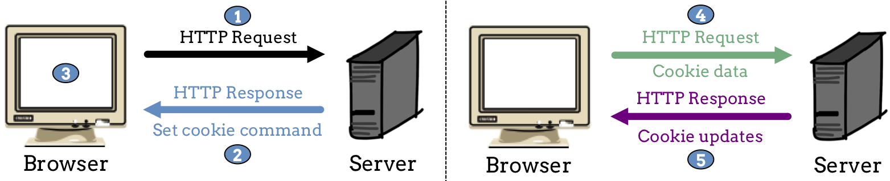

Cookies
=======

At some point, we've all received an alert in our browser that says something
like, *This website uses cookies*. We hear about cookies all the time, but many
users don't think about them too deeply. They either choose *Accept* or
*Decline* when they see the alert, and then they move on to the next task.

To help us make our Flask applications more efficient, we'll start by taking a
closer look at cookies.

Cookie Ingredients
------------------

.. index:: ! cookie

A **cookie** is just a text file that stores data. Browsers use cookies to help
users navigate a specific website. For example, a cookie can store a user's zip
code, which helps a shopping app find the closest store.

By design, cookies are very small (< 4 kB). Each one consists of a single
key/value pair, like ``zip_code = 63108``. As we surf the web, the browser
stores cookies on our device, usually in the same directory as our browser.

Since the file size is so small, a single website often stores many cookies on
our machine.

.. admonition:: Note

   A deep dive into cookie syntax is beyond the scope of this text. However,
   if you are curious, here are some good resources to get you started:

   #. `All About Cookies <https://www.allaboutcookies.org/faqs/cookie-file.html>`__
   #. `Cookie playlist from Udacity <https://www.youtube.com/playlist?list=PLs5n5nYB22fLqBWEGW0dBh_yIHdzYlpEz>`__
   #. `How Stuff Works <https://computer.howstuffworks.com/cookie1.htm>`__
   #. `HTTP Cookies <https://developer.mozilla.org/en-US/docs/Web/HTTP/Cookies>`__
      on the MDN website.

Cookie data is temporary. However, it usually *persists* longer than the values
we assign to Python variables. Cookies often survive after we refresh a page or
exit out of our browser.

.. admonition:: Tip

   We can use the browser preferences to control how long cookies remain saved
   on our device. We can also remove cookies at any time.

   For example, in Firefox we can check our cookie settings by selecting the
   *Privacy & Security* option under *Preferences*. Other browsers provide
   similar features.

   .. figure:: figures/cookie-settings.png
      :alt: Browsers let users manage how cookies are stored on their device.

      We can customize how our browser deals with cookies. We can also clear the data right now.

How Cookies Work
----------------

One thing we need to remember about cookies is that they are NOT programs. They
just store a small amount of data that web servers can use when we visit a site.
Here's a summary of how the cookie process works:

#. The first time we navigate to a webpage, our browser sends an HTTP request
   (``GET`` or ``POST``) to the server.
#. The server sends back an HTTP response, which contains data to display on
   the page. The response also includes a command to create one or more
   cookies.
#. The browser creates the cookie files and stores them on our machine.
#. When our browser communicates with the server again, it includes all of the
   saved cookies with the new HTTP request. The server uses the information to
   help it process the request.

   Cookies set by a specific server can only be sent back to that server. For
   example, a cookie set by `Trinket <https://trinket.io/>`__ won't be sent to
   the `GitHub <https://github.com/>`__ server.
#. When the server responds to the new request, it can update the existing
   cookies or create new ones.

   Servers use commands to set cookies. Browsers create and save cookie files on a user's device.

Cookies serve several purposes:

#. To keep us logged into a site.
#. To store helpful data for the server during our visit. For example:
   
   a. Our current score in a game we're playing. If we need to close the tab
      when our teacher/parent/boss walks by, cookies save our progress until we
      return.
   b. The contents of a shopping cart. When we select *Checkout* to complete an
      online order, cookies identify the items we want to buy.
#. To track and analyze our behavior.
   
   a. Have you received targeted adds while searching the web? Cookie data
      influences what you see!
   b. Watch this `short video clip <https://youtu.be/qMFRRoh6vV8>`__ that
      describes how cookies are used to track your movement on the web.

Check Your Understanding
------------------------

.. admonition:: Question

   A cookie is a small program that runs in the browser.

   .. raw:: html

      <ol type="a">
         <li><input type="radio" name="Q1" autocomplete="off" onclick="evaluateMC(name, false)"> True</li>
         <li><input type="radio" name="Q1" autocomplete="off" onclick="evaluateMC(name, true)"> False</li>
      </ol>
      

.. Answer = False

.. admonition:: Question

   Where is a cookie file saved?

   .. raw:: html

      <ol type="a">
         <li><input type="radio" name="Q2" autocomplete="off" onclick="evaluateMC(name, false)"> On a web server</li>
         <li><input type="radio" name="Q2" autocomplete="off" onclick="evaluateMC(name, false)"> In an open browser application</li>
         <li><input type="radio" name="Q2" autocomplete="off" onclick="evaluateMC(name, true)"> On the user's device</li>
         <li><input type="radio" name="Q2" autocomplete="off" onclick="evaluateMC(name, false)"> In the cloud</li>
      </ol>
      

.. Answer = c
