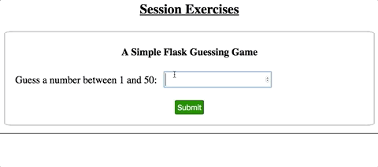

Exercises: Flask Sessions
=========================

In these exercises you will build a Flask app that uses sessions to run a
number guessing game.

Part A: Clone the Repository
----------------------------

To save you some time, clone the starter code from this
`GitHub repository <https://github.com/LaunchCodeEducation/LCHS_session_exercises>`__.

#. Follow the same steps you used :ref:`earlier in this chapter <clone-venv-reminder>`
   to download the project files, create a new virtual environment, install
   Flask, and commit your changes.

   .. admonition:: Note

      In the :ref:`.gitignore file <create-gitignore>`. Be sure to replace the
      entry in line 1 with the name of *your* new virtual environment.

#. When ready, the project file tree should look something like this:

   .. figure:: figures/session-exercises-file-tree.png
      :alt: File structure for the session exercises starter code.

      The name you gave to your virtual environment will appear instead of ``session-env``. 

#. Launch ``main.py``, and open the Flask app in a browser tab. You should see
   a plain looking web form.

   .. figure:: figures/exercises-start.png
      :alt: A web form for entering numerical guesses.
      :width: 80%

      The ``index.html`` page rendered by the starter code.

Part B: Set the Numbers
-----------------------

Your first task is to save three numbers to the ``session`` object: the
``magic_number`` players need to guess, and the high and low values for the
guessing range.

#. Open ``main.py`` in Visual Studio Code. Notice that variables for
   ``low_value``, ``high_value``, and ``magic_number`` are already set.

   .. sourcecode:: python
      :lineno-start: 13

      low_value = 1     # Sets the low end of the guessing range.
      high_value = 50   # Sets the high end of the guessing range.
      magic_number = random.randint(low_value, high_value)

   Line 15 randomly selects an integer from within the range and assigns it to
   the ``magic_number`` variable.
#. Refactor line 15 to save the random integer to the ``session`` object.
   Use ``magic_number`` as the key.

   .. sourcecode:: python
      :lineno-start: 15

      session['magic_number'] = random.randint(low_value, high_value)
#. On lines 16 and 17, save the low and high values to the session object.
   Remember to use descriptive key names!

By storing the three numbers in the session, you do NOT need to pass the values
to ``index.html`` from the ``render_template()`` function.

Display the Number Range
^^^^^^^^^^^^^^^^^^^^^^^^

Open the ``index.html`` file. Notice that the label for the input box always
displays the same text, ``Guess a number between 1 and 100``.

#. Replace the ``1`` and ``100`` with placeholders. Inside each set of braces,
   use the session object to access the low and high ends of the guessing
   range.
#. Save the changes, then reload the webpage. Does the label now show a
   range from 1 to 50? If not, adjust your placeholder syntax until it does.
#. Return to ``main.py`` and change the numbers assigned to ``low_value`` and
   ``high_value``. After saving, reload the webpage. The input box label should
   change to match your new numbers.
#. When your page correctly displays the numbers saved to the session, stop the
   program and commit your code. You're ready to move on.

.. admonition:: Tip

   Did you change the ``Form title goes here`` text? You weren't given any
   instructions to do so. However, at this point in the class, we shouldn't
   need to tell you how to fix every minor thing!

Part C: Check User Guesses
--------------------------

In ``main.py``, replace the ``pass`` keyword on line 11 with code that deals
with a user's guess.

Your code should:

#. Collect the user's guess from the form and convert it to an integer. Note
   that in ``index.html``, the ``input`` tag contains the attribute
   ``name="guess"``.
#. Access the low, high, and magic number values from the session as needed.
#. Check if the guess is within the required range. If ``False``, reload the
   form and display an error message. This should appear instead of the
   ``Feedback messages will go here`` text.
#. If ``True``, compare the user's guess to ``magic_number``.

   a. If the guess is too low, reload the form with the proper feedback
      message.
   b. If the guess is too high, reload the form with the opposite feedback
      message.
   c. If the guess is correct, reload the page with a victory message!

#. When the user's guess is less than the magic number, reassign the low value
   stored in the session. This should update the input label on the form.

   When the guess it too high, reassign the top value stored in the session.

When done, your app should behave like this:

   Wow! Three tries (not counting invalid entries).

Take a moment to save and commit your work!

Part D: Finalize Form
---------------------

After the user guesses the correct number, what then? Obviously, the
application should not keep taking guesses!

#. In ``main.py`` create a session variable called ``still_guessing``.
#. Initially, ``still_guessing`` should be ``True``. However, when the user
   guesses correctly, the value should flip to ``False``.
#. Add some Jinja3 logic to the ``index.html`` template. If ``still_guessing``
   is ``True``, display the original form. When ``False``, display a different
   form.
#. The second form should contain a single ``Play Again`` button. When clicked,
   the page sends a ``GET`` request to the server. This will reset the guessing
   range and assign a new ``magic_number`` value.

   .. figure:: figures/success-screen.png
      :alt: Form showing a Play Again button above a celebratory message.
      :width: 80%

      Clicking ``Play Again`` resets the game with a new magic number.

Don't forget to save and commit your work!

Part E: Optional Updates
------------------------

Your Flask app now functions as a simple number guessing game. However, this
doesn't mean the project is completely finished! There are a number of
improvements you can make to practice the skills you learned earlier in this
course.

Feel free to try some of these:

#. Use CSS to make the form, feedback messages, etc. nice to look at.
#. Add a counter to keep track of how many tries it takes to guess the correct
   number.
#. Add a ``Start Over`` option to let users reset the game before they guess
   correctly.
#. Randomly select the high and low values for the guessing range.
#. In ``main.py``, add some :ref:`server-side validation <server-side-validation>`
   to make sure the user submits an integer.
#. Convert the game to rock-paper-scissors!
