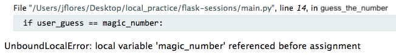

Keeping Track of Data Values
============================

In the past two chapters, you created Flask applications to collect user data
and display it on a webpage. However, you may have noticed that when you reload
the page, any data collected from the form disappears. The same thing happens
if you close the page tab, restart the application, or quit the browser
completely. Any data assigned to the Python variables is *temporary*.

This behavior also means we need to be very careful about sending data back and
forth between our Python code and a Jinja2 template.

Problem With Guessing a Number
------------------------------

Let's take a look at a function that asks a user to guess a secret number.

.. admonition:: Example

   **The webpage**:

   .. figure:: figures/guess-the-number.png
      :alt: Form asking the user to submit a number.

      A simple guess the number form.
   
   **The Python code**:

   .. sourcecode:: Python
      :lineno-start: 7

      @app.route('/guess_the_number', methods=['GET', 'POST'])
      def guess_the_number():
         if request.method == 'POST':
            # Collect the user's entry from the web form:
            user_guess = int(request.form['user_guess'])

            # Check if the user guessed correctly:
            if user_guess == magic_number:
               message = 'You guessed the number!'
            else:
               message = 'Nope! Try again.'
         else:
            magic_number = random.randint(1, 50)  # Create a random number from 1 - 50.
            message = ''

         return render_template('guess_the_number.html', message=message)

   #. Line 19 generates a random number and assigns the value to
      ``magic_number``.
   #. Line 22 renders the ``guess_the_number`` template, which displays a form
      for the user.

Unfortunately, when we run the application and make a guess, the program
crashes when we click *Go!*

   Unbound local error: ``magic_number`` referenced before assignment.

Reading the error message tells us what went wrong. In line 14,
``magic_number`` hasn't been assigned a value. If we think about the flow of
the program, this might seem odd at first.

#. The browser sends a ``GET`` request to the ``guess_the_number()`` function.
#. This triggers the ``else`` clause on line 18, and ``magic_number`` is
   assigned a random number from 1 - 50.
#. Line 22 renders the form in the browser, and the user submits their guess.
#. The browser sends a ``POST`` request to the function, and line 11 collects
   the user's guess.

Following these steps, it seems like ``magic_number`` should have a value.
However, this is not the case. The ``return`` statement on line 22 renders the
template, but it also ends the ``guess_the_number()`` function. When this
happens, the value we assigned to ``magic_number`` is lost.

When the function runs after the ``POST`` request, Python treats
``magic_number`` as a brand new variable. The expression
``user_guess == magic_number`` throws an error because ``magic_number`` has not
been assigned a value yet.

One Solution
------------

With a little work, we can modify the ``guess_the_number()`` function to avoid
the error. One way to do this is to send ``magic_number`` to the template, and
then collect it again after the user submits the form. However, this isn't
ideal.

Assigning a value to ``magic_number``, sending it to the template, and then
pulling it back into the same function is inefficient. Also, sending
``magic_number`` to the template makes it part of the HTML page. Even if we
hide it, users who know how to use the browser tools can find the data. If our
goal is to have users guess a secret number, we don't want to give them the
answer!

A Better Solution
-----------------

.. index:: ! persistent data

For many web applications, we want data to **persist**. This means saving the
information even if the user refreshes the page, closes the tab, or quits their
browser completely. Persistent data also stays around after a ``return``
statement ends a function.

In this chapter, we will learn two ways to handle short-term data storage. In
the following chapters, we will use a *database* to save information over a
longer period of time.
