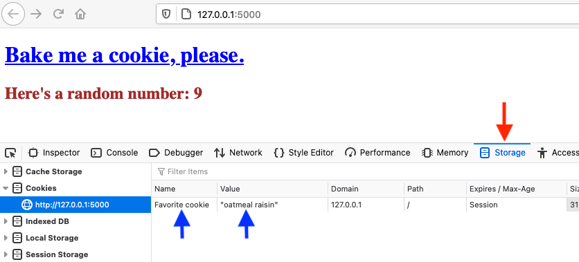
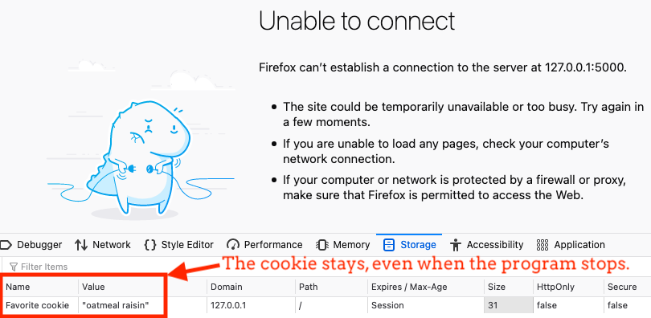
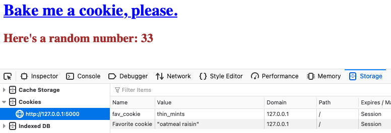

Flask Cookies
=============

When a server executes code to create a cookie, part of the command sets a time
limit for how long to save the data. If no time is given in the code, then the
cookie gets erased when we quit the browser. Putting our device to sleep or
closing the tab does NOT clear cookies!

Recall that Flask runs a server on our machine when we launch an application.
This means we can include some Python code to set and access our own cookies.

Let's see how to do this.

Cookie Video
------------

Watch this short clip to learn how to set cookies with Flask. You can find the
starter code in this `GitHub repository <https://github.com/LaunchCodeEducation/LCHS_cookie_intro.git>`__.
By switching between the ``main`` to ``final-code`` branch, you can view both
the starting and ending points of the demonstration.

.. admonition:: Note

   To run the app, you will need to create a new virtual environment, activate
   it, and install Flask. The repository includes a README file that guides you
   through this process. You can also review the steps
   :ref:`here <flask-environment>`.

.. raw:: html

   <section class="vid_box">
      <iframe class="vid" src="https://www.youtube.com/embed/V-jAPj6fETg" frameborder="1" allow="accelerometer; autoplay; clipboard-write; encrypted-media; gyroscope; picture-in-picture" allowfullscreen></iframe>
   </section>

.. index:: ! make_response, ! set_cookie method

**Video Highlights**:

#. To use Flask to set cookies, stat by importing ``make_response`` from the
   ``flask`` library.
#. The ``make_response()`` function builds the HTTP response sent by the server
   to the browser.
#. In the previous Flask chapters, we sent HTTP responses with
   ``render_template()``. ``make_response()`` lets us do the same thing, but
   it also allows us to set cookies.
#. The argument for ``make_response()`` can be a simple string like
   ``"Hello, World!"``, or it can be the result returned by the
   ``render_template()`` function.

   .. sourcecode:: Python

      response_name = make_response("Hello, World!")

      # OR

      response_name = make_response(render_template('template_name.html'))

#. To set cookies, we use the (wait for it...) ``.set_cookie()`` method!
   The general syntax for the method is:

   .. sourcecode:: Python

      response_name.set_cookie(cookie_name, cookie_value)
   
   ``response_name`` is the variable that holds the result from
   ``make_response()``. ``cookie_name`` and ``cookie_value`` must be strings.

#. The ``set_cookie()`` method can take other arguments as well. However, these
   go beyond the scope of this course. If curious, you can find a more complete
   description for ``set_cookie()`` `here <https://pythonise.com/series/learning-flask/flask-cookies#setting-cookies>`__.

Viewing Cookies
---------------

As shown in the video, we can use our browser tools to view the cookies saved
for a particular webpage. The specific commands will vary with each browser,
but right-clicking on the page is a good thing to try first. Select
*Inspect Element* from the options that pop up, and then open the *Storage*
tab. (For the Chrome browser, the tab is called *Application*).

   View stored cookies by using the browser tools. You might need to look carefully to find the tab you want!

.. admonition:: Tip

   **Safari Users**: If right-clicking on the page doesn't show the *Inspect
   Element* option, you need to activate the Developer Tools.

   Under the *Safari* menu, select *Preferences*. Click the *Advanced* tab,
   then select the *Show Develop menu in menu bar* option. Right-clicking
   should now work as expected!

Note that the cookie data is NOT sent to the webpage as a value. Instead, the
browser saves a file on our machine to keep track of the key/value pair. Even
if we stop the Flask application, the cookie *persists*.

   Even when we stop the Flask application, any cookies set by the program remain on our device.

If we change the name of the cookie in our Python code and refresh the page, a
new cookie file is saved. However, the old cookie file remains.

   Renaming a cookie does not remove the old file.

Accessing Cookie Data
---------------------

Once Flask saves cookies to our device, every request sent from our browser to
the server includes the data from ALL of those files. We can access this data
with the ``request`` keyword.

To collect all of the cookie data, the syntax is:

.. sourcecode:: Python

   all_cookies = request.cookies

When ``request.cookies`` executes, it returns a collection of key/value pairs
and assigns it to ``all_cookies``. Each pair matches one of the cookie files
stored on our device. To access the value of a specific cookie, we use bracket
notation, ``all_cookies['cookie_name']``.

To access just one of the cookie values, we use the syntax:

.. sourcecode:: Python

   cookie_value = request.cookies.get('cookie_name')

When this statement executes, Python scans the cookie data sent with the HTTP
request. If ``cookie_name`` matches one of the keys (like ``fav_cookie``), then
the value for that key is assigned to ``cookie_value``.

Resources
---------

This page just scratches the surface on how to use Flask to manage cookies. We
won't need to go deeper for this course. However, for those who would like to
explore further, here are a couple of good places to start:

#. `Flask Cookies <https://pythonise.com/series/learning-flask/flask-cookies>`__
#. `OverIQ <https://overiq.com/flask-101/cookies-in-flask/>`__

Check Your Understanding
------------------------

.. admonition:: Question

   Where is cookie data stored?

   .. raw:: html

      <ol type="a">
         <li><input type="radio" name="Q1" autocomplete="off" onclick="evaluateMC(name, true)"> In a file on our device.</li>
         <li><input type="radio" name="Q1" autocomplete="off" onclick="evaluateMC(name, false)"> In the webpage open in our browser.</li>
         <li><input type="radio" name="Q1" autocomplete="off" onclick="evaluateMC(name, false)"> As a value assigned to a variable.</li>
         <li><input type="radio" name="Q1" autocomplete="off" onclick="evaluateMC(name, false)"> On a web server.</li>
      </ol>
      

.. Answer = a

.. admonition:: Question

   Refreshing a webpage erases cookies.

   .. raw:: html

      <ol type="a">
         <li><input type="radio" name="Q2" autocomplete="off" onclick="evaluateMC(name, false)"> True</li>
         <li><input type="radio" name="Q2" autocomplete="off" onclick="evaluateMC(name, true)"> False</li>
      </ol>
      

.. Answer = b

.. admonition:: Question

   Quitting the browser application erases cookies.

   .. raw:: html

      <ol type="a">
         <li><input type="radio" name="Q3" autocomplete="off" onclick="evaluateMC(name, false)"> Always</li>
         <li><input type="radio" name="Q3" autocomplete="off" onclick="evaluateMC(name, false)"> Never</li>
         <li><input type="radio" name="Q3" autocomplete="off" onclick="evaluateMC(name, true)"> Sometimes</li>
      </ol>
      

.. Answer = c
