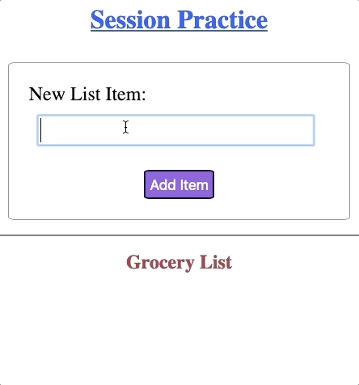

Try It! Flask Sessions (Part 2)
===============================

Now that we can set and access a Flask session, let's collect entries from the
form and add the items to our list.

.. admonition:: Note

   In the code blocks below, the generic ``list_name`` has been replaced with
   ``groceries``. Feel free to use a different variable name to better describe
   the elements in your own list.

Add Form Entries to List
------------------------

The HTML code for the form is complete. However, there is currently no code in
``main.py`` to handle form submissions. Let's fix that.

Return to ``main.py``, and replace the ``pass`` keyword in line 10 with this
block of 4 statements:

.. sourcecode:: python
   :lineno-start: 7

   @app.route('/', methods=['GET', 'POST'])
   def index():
      if request.method == 'POST':
         new_item = request.form['new_item']
         current_list = session['groceries']
         current_list.append(new_item)
         session['groceries'] = current_list
      else:
         session['groceries'] = []

**Code breakdown**:

#. **Line 10**: Requests the entry submitted from the web form and assigns the
   string to ``new_item``.
#. **Line 11**: Retrieves the ``groceries`` list stored in ``session`` and
   assigns it to ``current_list``.
#. **Line 12**: Appends ``new_item`` to the end of ``current_list``.
#. **Line 13**: Reassigns ``current_list`` to the session.

Since ``groceries`` is already a key in ``session``, line 13 replaces its old
value with the updated list.

Save the changes, then reload the webpage. Try submitting a few new items from
the form. You should see each entry appear on the page after you click the
*Add Item* button.

Avoid Duplicate Entries
^^^^^^^^^^^^^^^^^^^^^^^

As written, the Python code allows users to add the same item to the list
multiple times. While this behavior isn't wrong, it doesn't fit with the idea
of a grocery list.

Modify your code to prevent repeats from happening.

#. Add a conditional to check if ``new_item`` is already present in
   ``current_list``. If so, don't add it again. If not, append it to the list.
#. To prevent issues with case (e.g. ``"Apples"`` vs. ``"apples"``), add a
   string method to the form request on line 10. ``.lower()``, ``.upper()``,
   ``.capitalize()``, and ``.title()`` all work well.
#. Your code will look something like this:

   .. sourcecode:: python
      :lineno-start: 10

      new_item = request.form['new_item'].title()  # Standardize case for form entries.
      current_list = session['groceries']
      if new_item not in current_list:          # Check if new_item is actually new.
         current_list.append(new_item)
      session['groceries'] = current_list       # Update the session value.
#. Save your changes, then test your application.

Fix the Logic Error
^^^^^^^^^^^^^^^^^^^

When the browser sends a ``GET`` request to the Flask server, the ``index()``
function saves an empty list to the ``session``.

.. sourcecode:: python
   
   session['groceries'] = []

While this is fine the first time we visit the page, it doesn't help if we have
existing data.

.. admonition:: Try It!

   In the application tab, click in the address bar and tap *Enter*. This sends
   a ``GET`` request to the server. Notice that any list items displayed on the
   page disappear!

If our list already contains data, we want to keep those elements after a
``GET`` or ``POST`` request.

Before assigning an empty list to the ``groceries`` key, we need to check to
see if it already exists in ``session``. If ``groceries`` is NOT part of the
session yet, then we should add it and assign the empty list. If ``groceries``
is currently a key in ``session``, then we keep it as-is.

#. Update the ``else`` clause in the ``index()`` function as follows:

   .. sourcecode:: Python
      :lineno-start: 7

      @app.route('/', methods=['GET', 'POST'])
      def index():
         if request.method == 'POST':
            new_item = request.form['new_item'].title()
            current_list = session['groceries']
            if new_item not in current_list:
               current_list.append(new_item)
            session['groceries'] = current_list
         else:
            if 'groceries' not in session:
               session['groceries'] = []

#. When the browser sends a ``GET`` request, the ``else`` clause runs.

   a. Line 16 checks if the ``groceries`` key does NOT exist in the ``session``
      object. 
   b. If ``True``, then the program creates the ``groceries`` key and assigns
      it an empty list.
   c. If ``False``, the code makes no changes to the existing data.

#. Test your program by adding a few items to the list. Then try:
   
   a. Loading the page from the address bar.
   b. Opening the application in a new tab.
   c. Stopping and restarting ``main.py``.

   In each case, the contents of your list should persist.

Delete Session Data
-------------------

So far, we've used the browser tools to remove a session cookie. While this
works well for visitors to our website, it's not an option for us as the
programmers. Since session files are stored on a user's device, they decide how
to manage them. Well behaved coders do NOT delete files on someone else's
computer!

While we cannot remove a session file, we can clear some or all of the data
stored in it. There two methods we can use to remove data from a session.

#. To remove ALL key/value pairs from a session, the syntax is:

   .. sourcecode:: python

      session.clear()
#. To remove a single key/value pair from a session, the syntax is:

   .. sourcecode:: python

      session.pop('key', None)

   Without the ``None`` argument, ``.pop()`` throws an error if ``key`` does
   not exist in the session. We could use anything in place of ``None``, like
   ``5`` or ``"Hello, World!"``. However, ``None`` represents an empty value,
   so it makes sense for a missing key.
   
   Including ``None`` sets it as a default value. If ``key`` is missing, then
   ``.pop()`` returns ``None`` as its result, and our program keeps running.

Remove a Specific Value
^^^^^^^^^^^^^^^^^^^^^^^

Since the session in our demo application stores only one key/value pair, using
``.clear()`` and ``.pop()`` produce the same result.

What if we want to remove only one item from the stored list instead of the
entire collection? For that, we need to do a little more work. Right now, if
``new_item`` is NOT part of the list, it gets added to the collection.
Otherwise, nothing happens.

Let's update the conditional on line 12 to either add a new item to the list or
delete an existing element.

#. Add an ``else`` clause to delete an entry from the list. If the user submits
   an item that already exists, it is removed from the collection.

   .. sourcecode:: python
      :lineno-start: 12

      if new_item not in current_list:
         current_list.append(new_item)
      else:
         current_list.remove(new_item)
#. Test your code by adding then removing several items. Be sure to check that
   the form submissions are case-insensitive.

When done, your application should behave something like this:

Final Touches (Optional)
------------------------

Your Flask app now allows you to add and remove items. However, there are a few
extra features that will improve the user experience and make your project more
polished.

These tasks don't teach you anything new about sessions, but they do provide a
good review of older skills.

#. Use the ``.sort()`` method to alphabetize your list. Experiment with using
   ``session['groceries'].sort()`` vs. ``current_list.sort()``. Is there a
   difference?
#. Use CSS to make the page look nice.
#. After an item is added to the list, display a message for the user.
   Something like, ``You just added ___``.
#. Instead of an unordered list, use a checkbox form to display the items. When
   submitted, any items checked in the form will be removed from the list.

   .. figure:: figures/checkbox-remove.png
      :alt: Checkbox form allowing users to remove multiple items at once.
      :width: 40%

      This is MUCH easier than having to type in the items you want to remove!

.. admonition:: Tip

   Checkout the ``final-code`` branch of the repository to examine one possible
   solution for the checkbox form.

   Also, the ``buttons`` branch in the repo shows one way to retrieve data from
   a ``<button>`` element rather than an input box.
