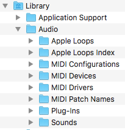
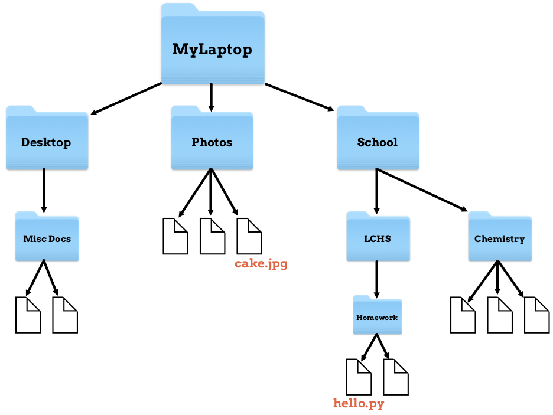

Filesystem and Paths
====================

.. index:: ! filesystem, ! directory, ! subdirectory
   single: directory; root
   single: directory; parent
   single: directory; sub

A **filesystem** on a computer controls how data is stored and retrieved on the
device. One important job of the system is to organize data in a series of
files and folders.

Inside a filesystem, folders are called **directories**. Folders nested inside
other folders are called **subdirectories**. Folders that store others are
called **parent directories**.

.. admonition:: Example

   Most of us have a ``Desktop`` folder on our computers. If there is a folder
   on our Desktop called ``LCHS_Homework``, then the parent directory is
   ``Desktop`` and the subdirectory is ``LCHS_Homework``.

Computer file systems start with one top-level directory that holds everything
else on the machine. This is called the **root directory**. In most cases, the
root directory refers to the primary hard drive. For Windows, that's the
``C drive``. On a Mac, we refer to the root directory with ``/``.

.. index:: ! path
   single: path; absolute
   single: path; relative

A **path** for files and folders is the list of directories that the computer
must follow to find a particular item. This begins with the root directory and
ends with the name of the required item. Think of a path as a set of directions
to get from point A to point B.

.. admonition:: Try It!

   #. Open the terminal on your device. The window won't show much, but the
      last line of text will include a prompt similar to:

      .. sourcecode:: bash

         Mac
            device_name:directory_name username$

         Windows
            username@device_name MINGW64 path$

      ``device_name`` is the name for your machine, like ``MyLaptop``.
      ``directory_name`` and ``path`` show your current location in the file
      system. ``username`` is you. ``MINGW64`` you can ignore.
   
      The symbol that appears after your username can vary (``$``, ``%``,
      ``>``, etc.), but it indicates where to type commands.
   
   #. At the prompt, type the command ``pwd`` and tap *Enter*.
   #. ``pwd`` stands for ``print working directory``. The output shows the path
      from the root directory to your current location in the file system. For
      example:

      .. sourcecode:: bash

         /Users/mjordan/lchs/projects

File systems use two different types of paths: *absolute* and *relative*.
The **absolute path** starts at the root directory and ends with the file name.
The **relative path** starts at the current directory and ends with the file
name.

.. admonition:: Example

   Let's assume we have a file inside the ``LCHS_Homework`` directory called
   ``hello.py``. The absolute path would look something like this:

   ::

      Mac:
      /Users/StudentName/Desktop/LCHS_Homework/hello.py

      Windows:
      C:\windows\Desktop\LCHS_Homework\hello.py

   If we are currently in the ``Desktop`` directory, then the relative path for
   ``hello.py`` is:

   ::

      Mac:
      /LCHS_Homework/hello.py

      Windows:
      \LCHS_Homework\hello.py

Many programmers use paths to navigate through the filesystem in the terminal.
We will practice this in the next section.

As we work with the CLI more, paying attention to correct file paths becomes
very important!

Picture This
------------

.. index:: ! file tree

Computers are basically file storage systems. Sure, they have many applications
installed, but where do these programs live? In directories, of course!

**File trees** help us see the structure of the filesystem. They show the
connections between different files and directories. We see them all the time
when we open a window on our computer. For example:

   This file tree shows two levels of subfolders in the Library directory.

The amount of indentation tells us which directories are at the same level
(``Application Support`` and ``Audio``). It also helps us spot the
subdirectories nested within a particular folder.

The terminal gives us one way to navigate these directories. Let's use another
file tree to help us visualize what a path represents.

   A path provides directions for moving through the file tree.

In this diagram, ``MyLaptop`` represents the parent directory. Subdirectories
that are at the same level in the filesystem appear in the same row.

Now imagine that we are standing inside of the file tree. A *path* gives us a
map to follow to find a particular file or directory. For example, the path for
the ``cake.jpg`` file is ``/MyLaptop/Photos/cake.jpg``. If we are standing
inside the ``MyLaptop`` folder, the path tells us, *Move into the Photos
subdirectory and look around. You should see a file called 'cake.jpg'.*

For the ``hello.py`` file, the path is
``/MyLaptop/School/LCHS/Homework/hello.py``. This map tells us, *Start in the
MyLaptop directory. Move into the School folder, then the LCHS folder, then the
Homework folder. Look around to find a file called 'hello.py'.*
