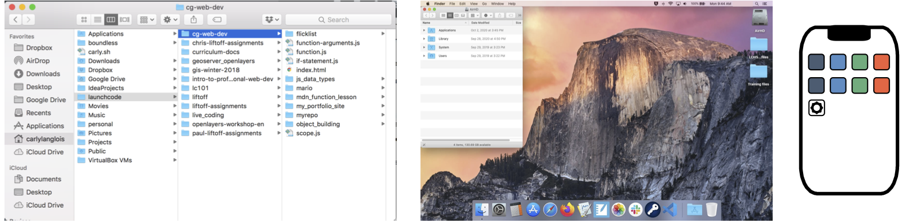

What is a Terminal?
===================

GUIs and CLIs
-------------

.. index:: ! graphical user interface, ! GUI

Most of the time when we use our computers and smartphones, we do so through a 
**graphical user interface**, or **GUI** for short. A GUI is a system designed
to use icons and visual tools to manage tasks. Creating a new folder, running
programs, and moving or deleting files are all done by selecting menu items or
clicking icons on the screen.

   Three examples of graphical user interfaces: a folder navigation box, a desktop, and a smartphone home screen.

.. index:: ! command line interface, ! CLI

Programmers often use another kind of interface, called the **command line**. A 
**CLI**, or command line interface, uses text to give the computer instructions
instead of dragging and dropping icons. 

.. figure:: figures/CLI-example.png
   :alt: Sample command line interface.
   :width: 80%

   A CLI showing commands for navigating a file tree.

.. index:: ! terminal, ! shell

The application responsible for running a CLI is called a **terminal**. The 
program that interprets the commands is called the **shell**.

.. admonition:: Note

   The terms *command line*, *terminal*, and *shell* are often used
   interchangeably.

Why Use the Terminal?
---------------------

Both GUIs and CLIs allow us to access and modify files on our device. Most of
us are familiar with GUIs, and they are very user-friendly. However, using a
CLI makes some tasks easier or more efficient. We need to be familiar with both
types of interfaces.

In the terminal, we will be able to:

- Quickly move through our computer's file structure.
- Make new files and folders.
- Move or delete files and folders.
- Install software.
- Open applications.
- Run the programs we code.

.. _launch-terminal:

Launch the Terminal
-------------------

As you read the next few sections, it helps to have the terminal open. That way,
you can work through the examples and get used to the CLI. Follow the
instructions below to launch the application.

While we cannot predict the setup on your personal device, these guides should
point you in the right direction.

Mac Users
^^^^^^^^^

#. In the Finder, navigate to the *Applications* folder. Find the icon by
   opening the window for your hard drive. The folder icon may also appear in
   the dock.

   .. figure:: figures/applications-folder.png
      :alt: The application folder can be found in the dock or by double-clicking the hard drive icon.
      :width: 80%

      Double-click the hard drive icon to find the Applications folder, or check the dock.

#. Inside the *Applications* folder, find the *Utilities* folder.
#. Open the *Utilities* folder to find the Terminal application!
#. Another way to locate the application is to run a search in the Finder for
   "Terminal".

.. admonition:: Tip

   Once you locate the Terminal application, you can add it to the dock! Just
   drag and drop the icon into the dock. This lets you quickly launch the
   program the next time you need it.

Windows Users
^^^^^^^^^^^^^

.. index:: ! Git Bash

The terminal application we will use in this course is called **Git Bash**.

#. Open the *Start* menu by clicking on the Windows icon found in the lower
   left corner of the screen.
#. From the list of items that pops up, select *Git Bash* to open the CLI.
#. If the list is long, try typing “Git Bash” into the Start menu search bar.
   This narrows down the options displayed.

.. admonition:: Tip

   To put an icon for the CLI on your desktop, right-click on the *Git Bash*
   name in the start menu. Select the *Add Shortcut To Desktop* option. Another
   option pins GitBash to the taskbar.

Chromebook Users
^^^^^^^^^^^^^^^^

.. admonition:: Note

   If you use a virtual desktop for this class, login to that service. Follow
   the instructions for Mac or Windows, depending on the OS used for the
   desktop.

#. Expand the dock at the bottom of your Chromebook desktop.
#. Find *Terminal* in the list of icons that appears. The application is
   probably inside the *Linux apps* subfolder. It's icon shows the ``>_``
   symbols.

   .. figure:: figures/linux-apps-subfolder.png
      :alt: Find the terminal app inside the Linux subfolder.

#. Click on the icon to launch the program.

Replit Users
^^^^^^^^^^^^

.. admonition:: Note

   If you use Replit for this class, login to your account. 

#. Create a new python repl.
#. Click on the shell tab.

   .. figure:: figures/shell_tab.png
      :alt: Find the shell tab in replit workspace.

#. To run a file, at the prompt type python filename

   .. figure:: figures/run_shell.png
      :alt: Run a file from the shell tab in replit workspace.

