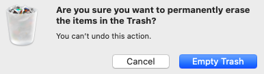

Navigating the Terminal Window
==============================

Moving from a GUI to a CLI can be tricky because we are used to dragging our
files from one folder to another. The first skill we need to practice is how to
figure out where we are in the filesystem!

On the previous page, we used ``pwd`` to print the path to our current
directory. However, we can also find clues inside the terminal prompt:

.. sourcecode:: bash

   Mac
      device_name:directory_name username$

   Windows
      username@device_name MINGW64 path$

``directory_name`` and ``path`` tell us our location in the system. As we enter
commands, ``device_name`` and ``username`` stay the same. However, ``path`` and
``directory_name`` change.

.. admonition:: Note

   In the remaining terminal examples, we will just display the ``$`` symbol
   from the prompt.

Moving Between Directories
--------------------------

We often need to move between directories in the file system. The command
``cd`` (for *change directory*) allows us to do this. The general syntax is:

::

   cd new_directory

``new_directory`` is the path for where we want to be. We do NOT need to
indicate our current location.

.. admonition:: Example

   Let's assume we want to move from our current location in the file tree
   (``Photos``) to ``Chemistry``.

   .. figure:: figures/cd-tree.png
      :alt: File tree with "Photos" marked as the current directory and "Chemistry" marked as the target.

   The terminal command to make this move appears on line 3:

   .. sourcecode:: bash
      :linenos:

      $ pwd
      /MyLaptop/Photos
      $ cd /MyLaptop/School/Chemistry
      $ pwd
      /MyLaptop/School/Chemistry

   In this case, we included ``pwd`` to show our starting and ending locations.
   However, these commands were not necessary for the move.

Navigation Shortcuts
^^^^^^^^^^^^^^^^^^^^

When moving through a file tree, we often only need to move up or down one
level. For quick changes like this, we don't need to type out a full path.

.. admonition:: Examples

   Let's say we want to move up one level from ``Chemistry`` to ``School``.
   Instead of typing out the entire absolute path, we can use a terminal
   shortcut!

   .. sourcecode:: bash
      :linenos:

      $ pwd
      /MyLaptop/School/Chemistry
      $ cd ..
      $ pwd
      /MyLaptop/School

   The ``cd ..`` shortcut tells the terminal, *From the current directory, move
   up one level*.

   To move down one level from a parent directory into a subdirectory, the
   path syntax is ``./directory_name``.

   .. sourcecode:: bash
      :linenos:

      $ pwd
      /MyLaptop/School
      $ cd ./LCHS
      $ pwd
      /MyLaptop/School/LCHS
   
   The ``.`` represents the path to the current directory. In this case, it
   stands for ``/MyLaptop/School``. The command on line 3 tells the terminal,
   *From the current directory, move into the LCHS subdirectory*.

The ``..`` and ``.`` shortcuts can also be part of a longer path. For example,
``cd ../..`` moves us up two levels from our current directory, while
``cd ./directory_name/other_directory_name`` moves us down two levels.

Feedback
--------

Another big difference between a GUI and a CLI involves the amount of feedback
we receive. With a GUI, we can see when we move, create, or delete a file. An
icon appears, moves, or disappears as we perform the action. Sometimes a window
even pops up to give us more information.

   A GUI provides visual feedback.

The terminal rarely displays an output to let us know when a change occurs. We
need to keep an eye on the prompt and be more deliberate about checking the
results of our commands.

Check Your Understanding
------------------------

Use this file tree to help answer the following questions:

.. figure:: figures/file-tree-cc.png
   :alt: File tree with "Homework" marked as the current directory and "Misc Docs" marked as the target.

.. admonition:: Question

   Assume we start in the ``Homework`` directory. In the terminal, we execute
   the following command:

   ::

      $ cd ../..

   What is the path to our new location in the filesystem?

   .. raw:: html

      <ol type="a">
         <li><input type="radio" name="Q1" autocomplete="off" onclick="evaluateMC(name, false)"> /MyLaptop/School/LCHS/Homework</li>
         <li><input type="radio" name="Q1" autocomplete="off" onclick="evaluateMC(name, false)"> /MyLaptop/School/LCHS</li>
         <li><input type="radio" name="Q1" autocomplete="off" onclick="evaluateMC(name, true)"> /MyLaptop/School</li>
         <li><input type="radio" name="Q1" autocomplete="off" onclick="evaluateMC(name, false)"> /MyLaptop</li>
      </ol>
      

.. Answer = c

.. admonition:: Question

   Which TWO of the following terminal commands gets us from ``Homework`` to
   ``Misc Docs``?

   .. raw:: html
      
      <ol type="a">
         <li>cd /MyLaptop/Desktop/MiscDocs</li>
         <li>cd /LCHS/School/MyLaptop/Desktop/MiscDocs</li>
         <li>cd ../../../Desktop/MiscDocs</li>
         <li>cd ./Desktop/MiscDocs</li>
      </ol>

.. Answers = a, c

